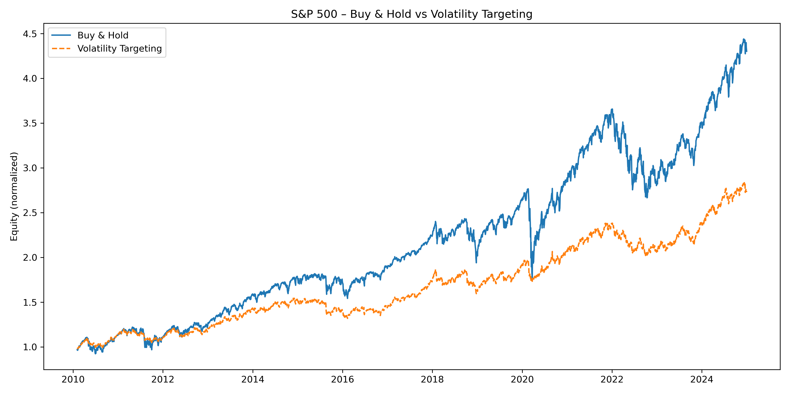

# Volatility Forecasting Lab – GARCH(1,1) on S&P 500

This project studies the behaviour of equity index volatility using daily S&P 500 returns from 2010 to 2024.  
It combines realized volatility measurement, GARCH(1,1) modelling, and a volatility-targeting trading strategy.  
The objective is to evaluate whether conditional volatility forecasts provide useful information for practical risk management.

---

## Overview

Volatility in financial markets is persistent and exhibits clustering: periods of low volatility tend to be followed by low volatility, and periods of high volatility tend to be followed by high volatility.  
Modelling this structure is fundamental in risk management, asset allocation, and derivative pricing.

This project:

- constructs realized volatility using rolling windows,
- estimates a GARCH(1,1) model on log-returns,
- compares conditional volatility forecasts with realized volatility,
- applies these forecasts to a volatility-targeting rule,
- evaluates performance relative to a Buy & Hold benchmark.

---

## Dataset

- **Asset:** S&P 500 Index (`^GSPC`)  
- **Frequency:** Daily  
- **Period:** 2010–2024  
- **Source:** Yahoo Finance (`yfinance`)

Returns are expressed as log-returns.  
Volatility is annualised assuming 252 trading days.

---

## Methodology

This section explains clearly the mathematical objects used in the project.

### 1. Realized Volatility

Realized volatility is the standard deviation of recent returns.  
We compute it over a 21-day rolling window and annualise it:

\[
\text{RealizedVol}_t = \sqrt{252}\;\cdot\;\operatorname{std}(r_{t-20}, \dots, r_{t})
\]

Interpretation:

- \( r_t \) are the daily log-returns,
- we take the standard deviation of the past 21 days,
- multiplying by \( \sqrt{252} \) expresses volatility on an annual scale.

This provides a smooth empirical estimate of volatility observed in the data.

---

### 2. GARCH(1,1) Model

A GARCH model expresses tomorrow’s volatility as a function of:

1. a long-term constant level \( \omega \),
2. the size of yesterday’s shock \( \alpha \varepsilon_{t-1}^2 \),
3. yesterday’s variance \( \beta \sigma_{t-1}^2 \).

The conditional variance equation is:

\[
\sigma_t^2
= 
\omega + \alpha \varepsilon_{t-1}^2 + \beta \sigma_{t-1}^2
\]

The returns follow:

\[
r_t = \mu + \varepsilon_t,\qquad 
\varepsilon_t = \sigma_t z_t,\qquad
z_t \sim N(0,1)
\]

Meaning:

- \( \sigma_t \) is the model’s estimate of volatility,
- \( z_t \) is a standard normal shock,
- \( \varepsilon_t \) is the return innovation.

Parameters \( \omega, \alpha, \beta, \mu \) are estimated via Maximum Likelihood.  
This model captures volatility clustering and persistence.

---

### 3. Volatility-Targeting Strategy

The conditional volatility forecast is used to scale exposure.  
The target annual volatility is set to 10%.

The portfolio weight each day is:

\[
w_t = \frac{\sigma_{\text{target}}}{\hat{\sigma}_{t}}
\]

where:

- \( \hat{\sigma}_t \) is the GARCH forecast for day \(t\),  
- weights are clipped between 0 and 2 (no shorting, max 2× leverage).

Interpretation:

- if forecasted volatility is **high**, exposure is **reduced**,  
- if forecasted volatility is **low**, exposure is **increased**.

Two equity curves are constructed:

- **Buy & Hold** (weight = 1 at all times),  
- **Volatility-Targeted Portfolio** (weight varies across time).

This simple rule implements practical risk management based on predicted volatility.

---

## Results

### Realized Volatility vs. GARCH Volatility

The GARCH(1,1) model broadly captures volatility regimes but reacts with delay during abrupt volatility spikes.  
This behaviour is expected given the model’s structure and lagged dependence.

---

### Equity Curve: Buy & Hold vs. Volatility Targeting

The volatility-targeting portfolio produces a smoother equity trajectory and lower drawdowns.  
Risk-adjusted performance improves relative to passive exposure.

---

## Performance Metrics

The following metrics are computed:

- Annualised Sharpe ratio  
- Maximum drawdown  
- Annualised volatility of returns  
- MSE and MAE between realized volatility and GARCH volatility  

These metrics provide a quantitative comparison between the model’s predictive accuracy and its usefulness in portfolio applications.

---

## How to Run
